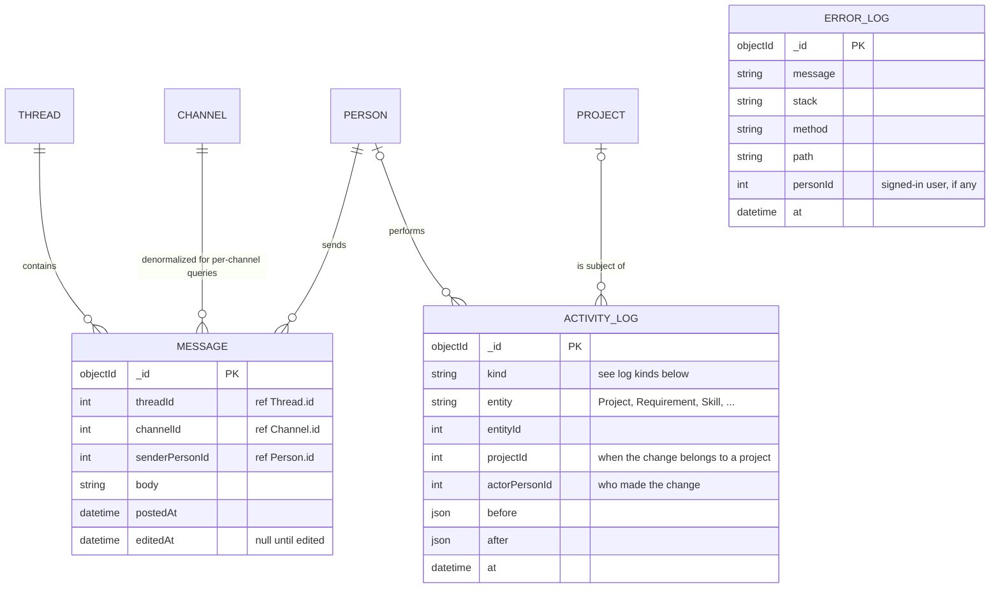

# ASC Project Management: Entity Relationship Diagram

This document describes the data model for the ASC Project Management Platform, built from the repository's issues. Field names follow the dummy data in `data/` and the Prisma schema in `generated/prisma/schema.prisma`.

The application uses two stores:

- **PostgreSQL (Prisma)** holds the relational core: projects, people, skills, statuses, documents, channels, threads, requirements, accounts, and roles.
- **MongoDB (Mongoose)** holds high-volume, append-heavy data: messages (#77) and the activity and error logs (#78 to #93).

---

## Relational Model (PostgreSQL)

```mermaid
erDiagram
    MAIN_BOARD_STATUS ||--o{ PROJECT : "places card in column"
    CLIENT ||--o{ PROJECT : "requests"
    PERSON |o--o{ PROJECT : "manages"

    PROJECT ||--o{ PROJECT_STATUS : "uses"
    STATUS ||--o{ PROJECT_STATUS : "is used by"

    PROJECT ||--o{ PROJECT_PERSON : "has team"
    PERSON ||--o{ PROJECT_PERSON : "works on"
    ROLE ||--o{ PROJECT_PERSON : "defines project role"

    PROJECT ||--o{ PROJECT_SKILL : "needs"
    SKILL ||--o{ PROJECT_SKILL : "is needed by"

    PERSON ||--o{ PERSON_SKILL : "has"
    SKILL ||--o{ PERSON_SKILL : "is held by"

    PROJECT ||--o{ PROJECT_PROJECT_TYPE : "is categorized as"
    PROJECT_TYPE ||--o{ PROJECT_PROJECT_TYPE : "categorizes"
    PROJECT_TYPE }o--o{ SKILL : "typically needs"

    PERSON ||--o| MENTOR : "may be"
    PERSON ||--o| STUDENT : "may be"
    PROJECT_TYPE |o--o{ MENTOR : "preferred by"
    PROJECT_TYPE |o--o{ STUDENT : "preferred by"

    PROJECT ||--o{ REQUIREMENT : "has tasks"
    STATUS ||--o{ REQUIREMENT : "is column of"
    PERSON |o--o{ REQUIREMENT : "is assigned"
    PERSON |o--o{ REQUIREMENT : "mentors"

    PROJECT ||--o{ DOCUMENT : "holds"
    PERSON |o--o{ DOCUMENT : "uploads"

    PROJECT ||--o{ CHANNEL : "communicates in"
    PERSON }o--o{ CHANNEL : "participates in"
    CHANNEL ||--o{ THREAD : "contains"
    PERSON |o--o{ THREAD : "starts"

    PERSON ||--o{ USER_ACCOUNT : "signs in with"
    PERSON ||--o{ ORGANIZATION_ROLE : "holds"
    ROLE ||--o{ ORGANIZATION_ROLE : "is granted as"

    PROJECT {
        int id PK
        string name
        string description
        int clientId FK
        int mainBoardStatusId FK
        int projectManagerId FK "Person"
        date startDate
        date midpointDate
        date endDate
        decimal budget
        float estimatedHours
        string notes
        datetime workspaceInitializedAt "set once, on first move to In Progress"
        json audit
    }

    MAIN_BOARD_STATUS {
        int id PK
        string name "Lead Generation, Hiring, In Progress, ..."
        string description
        int order "column position on the main board"
        json audit
    }

    STATUS {
        int id PK
        string name "To Do, In Progress, Done, ..."
        string description
        int order
        json audit
    }

    PROJECT_STATUS {
        int id PK
        int projectId FK
        int statusId FK
        int order "column position on the project board"
        json audit
    }

    CLIENT {
        int id PK
        string name UK
        string type "Profit, Non-Profit, Internal"
        string contactPersonName
        string contactEmail
        string phone
        json address
        string billingEmail
        string billingTerms
        json audit
    }

    PERSON {
        int id PK
        string firstName
        string lastName
        string email UK
        string phone
        json address
        json audit
    }

    MENTOR {
        int id PK
        int personId FK, UK
        string department
        string availability
        int maxProjectLoad
        int preferredProjectTypeId FK
        json audit
    }

    STUDENT {
        int id PK
        int personId FK, UK
        string major
        date graduationDate
        string resumeUrl
        float minHoursPerWeek
        float maxHoursPerWeek
        string workApprovalStatus
        string availability
        int preferredProjectTypeId FK
        json audit
    }

    PROJECT_PERSON {
        int id PK
        int projectId FK
        int personId FK
        string role FK "Role.name: Project Manager, Faculty Mentor, Student, Sponsor"
        date startDate
        date endDate
        float assignedHours
        string approvalStatus
        string status
        json audit
    }

    SKILL {
        int id PK
        string name UK
        string category
        string description
        json audit
    }

    PROJECT_SKILL {
        int id PK
        int projectId FK
        int skillId FK
        string importance "Required or Preferred"
        string minimumProficiency
        json audit
    }

    PERSON_SKILL {
        int id PK
        int personId FK
        int skillId FK
        string proficiency
        float yearsExperience
        date lastUsed
        json audit
    }

    PROJECT_TYPE {
        int id PK
        string name UK
        string description
        int typicalDurationWeeks
        string_array typicalDeliverables
        json audit
    }

    PROJECT_PROJECT_TYPE {
        int id PK
        int projectId FK
        int projectTypeId FK
        boolean isPrimary "at most one true per project"
        json audit
    }

    REQUIREMENT {
        int id PK
        int projectId FK
        string title
        string description
        int statusId FK
        string priority
        date dueDate
        int assignedPersonId FK "student doing the work"
        int mentorPersonId FK
        string acceptanceCriteria
        float estimatedHours
        float actualHours
        json audit
    }

    DOCUMENT {
        int id PK
        string name
        int projectId FK
        string type "Statement of Work, Reference, Design, ..."
        string fileName
        string fileUrl
        int personId FK "uploader"
        date uploadedDate
        string version
        string status
        json audit
    }

    CHANNEL {
        int id PK
        string name
        int projectId FK
        string type "Team, Client, Topic, Archived"
        string url
        date createdDate
        json audit
    }

    THREAD {
        int id PK
        int channelId FK
        string name
        int createdByPersonId FK
        datetime createdAt
        datetime lastActivityAt
        json audit
    }

    USER_ACCOUNT {
        int id PK
        int personId FK
        string provider "microsoft, github, cognito"
        string providerAccountId
        string email
        datetime createdAt
        datetime lastSignInAt
    }

    ROLE {
        int id PK
        string name UK
        string description
        string scope "organization or project"
    }

    ORGANIZATION_ROLE {
        int id PK
        int personId FK
        string roleName FK "Role.name, e.g. ASC Administrator"
        json audit
    }
```

---

## Document Model (MongoDB)

Messages and logs reference relational rows by id. MongoDB can't enforce those references, so the application has to check them.

The issues require a log for each of the following. The issues don't define a log schema, so the `ACTIVITY_LOG` shape above is a proposal. Each item could also be its own collection.

| Issue | Log | Subject |
|---|---|---|
| #78 | Application errors | `ERROR_LOG` |
| #79 | Project status changes | Project main board moves. Shows whether a project was ever in "In Progress" |
| #80 | Task status changes | Requirement moving between columns |
| #81 | Skill updates | Skill |
| #82 | Student profile updates | Student |
| #83 | Mentor profile updates | Mentor |
| #84 | Project mentor assignments | ProjectPerson (Faculty Mentor) |
| #85 | Project student assignments | ProjectPerson (Student) |
| #86 | Project updates | Project |
| #87 | Requirement updates | Requirement |
| #88 | Client updates | Client |
| #89 | Project type updates | ProjectType |
| #90 | Document updates | Document |
| #91 | Person skill updates | PersonSkill |
| #92 | Channel activity | Channel |
| #93 | Thread activity | Thread |

Sessions (#94) use the in-memory `express-session` store for now. A later ticket moves them to PostgreSQL or MongoDB.

---

## Entity Reference

| Entity | Purpose | Source issues |
|---|---|---|
| Project | The central record. It's a card on the main board, and its workspace, team, tasks, channels, and documents all hang off it | #1, #20, #39 |
| MainBoardStatus | The main board's columns (Lead Generation, Statement of Work, Hiring, In Progress, Billing, Close Out, Completed). Not a join table, because each Project points at one | #19, #23, #42 |
| Status | The task statuses used on each project's own board | #2, #21, #40 |
| ProjectStatus | Which statuses a project uses, and their column order | #3, #22, #41 |
| Client | The organizations or individuals who request projects | #16, #33, #52 |
| Person | Everyone involved with the ASC | #18, #24, #43 |
| Mentor | One-to-one extension of a Person for faculty mentors | #4, #25, #44 |
| Student | One-to-one extension of a Person for student workers | #5, #26, #45 |
| ProjectPerson | Who is on which project, in what role, for which dates and hours. These rows control project-level access | #12, #27, #46, #130 |
| Skill | Areas of expertise | #10, #28, #47 |
| ProjectSkill | Skills a project needs, with importance and minimum proficiency | #11, #29, #48 |
| PersonSkill | Skills a person has, with proficiency, years of experience, and when last used | #13, #30, #49 |
| ProjectType | Categories of work (Full-Stack, Data Engineering, ...) | #14, #31, #50 |
| ProjectProjectType | Project-to-type link with an `isPrimary` flag | #15, #32, #51 |
| Requirement | Project sub-tasks. In this app a requirement and a task are the same thing | #9, #38, #57 |
| Document | Files and materials attached to a project | #17, #34, #53 |
| Channel | Slack/Teams-style spaces for a project. `#general` is created when the project's workspace is created | #6, #35, #54 |
| Thread | A conversation inside a channel. The message count is computed, not stored | #7, #36, #55 |
| Message | A post in a thread, stored in MongoDB | #8, #37, #56, #77 |
| UserAccount | A sign-in method (provider + provider id) linked to a Person. A person can have more than one | #116 to #120, #117 |
| Role | The five README roles. ASC Administrator has organization scope. Project Manager, Faculty Mentor, Student, and Sponsor have project scope | #124 to #129 |
| OrganizationRole | An organization-wide role held by a person | #124, #125, #131 |

---

## Constraints and Business Rules

- **Unique pairs.** `ProjectStatus(projectId, statusId)`, `ProjectSkill(projectId, skillId)`, `PersonSkill(personId, skillId)`, `ProjectProjectType(projectId, projectTypeId)`, `ProjectPerson(projectId, personId, role)`, `Channel(projectId, name)`, `UserAccount(provider, providerAccountId)`, and `OrganizationRole(personId, roleName)` are each unique.
- **One primary type.** Each project has at most one `ProjectProjectType` with `isPrimary = true`. The application un-marks the others in the same transaction (#51).
- **Idempotent workspace creation.** A project's workspace (default statuses and the `#general` channel) is created only the first time the project moves into "In Progress". `Project.workspaceInitializedAt` and the project status change log (#79) record this, so moving out of and back into "In Progress" doesn't create a second workspace.
- **Role scoping.** A person can hold different project roles on different projects, for example Project Manager on one project and Student on another. A role assigned through `ProjectPerson` must have project scope, and a role assigned through `OrganizationRole` must have organization scope.
- **Project-level access.** Except for ASC Administrators, a user can reach a project's requirements, channels, threads, messages, and documents only if they have a `ProjectPerson` row on that project (#130).
- **Delete behavior.** Deleting a Project cascades to its join rows, requirements, documents, channels, and threads. Deleting a lookup row (Client, MainBoardStatus, Status, Role) is blocked while anything still references it.
- **Derived values.** A thread's message count is counted from its messages, not stored (#55).
- **Audit column.** Each relational model has an `audit` JSON column that records who created and last changed the row.

---

## Spec Items Not Yet Modeled

Issue #39 lists these project attributes. No issue gives them their own model yet, so they're either folded into existing entities or left for later:

| Spec item | Current handling |
|---|---|
| Statement of work | A `Document` with `type = "Statement of Work"` |
| Deliverables | `ProjectType.typicalDeliverables` covers the template. There's no per-project deliverable table |
| Tasks | Same as `Requirement` |
| Bills, billing info | `Client.billingEmail` and `Client.billingTerms`. There's no invoice table |
| Hours | `Project.estimatedHours`, `ProjectPerson.assignedHours`, `Requirement.estimatedHours` and `actualHours` |
| Milestones, meetings, approvals | Not modeled. Candidate future entities, alongside the README's `TaskComment`, `MessageReaction`, and `Notification` |

---

## Modeling Notes

- **Duplicate skill links.** `Mentor.skills` and `Student.skills` are implicit many-to-many tables in the Prisma schema, from the `skillIds` arrays in the dummy data. They overlap with `PersonSkill`, which links skills to the same people and also stores proficiency. The team should keep one, probably `PersonSkill`, so a person's skills live in one place.
- **Implicit join tables.** `Channel` participants and `ProjectType` typical skills use Prisma implicit many-to-many relations. Prisma generates their join tables (`_ChannelParticipants`, `_ProjectTypeSkills`), so they don't appear as named models.
- **Two project manager fields.** `Project.projectManagerId` and a `ProjectPerson` row with role "Project Manager" both record a project's manager. The team should treat one as the source of truth so the two can't disagree.
